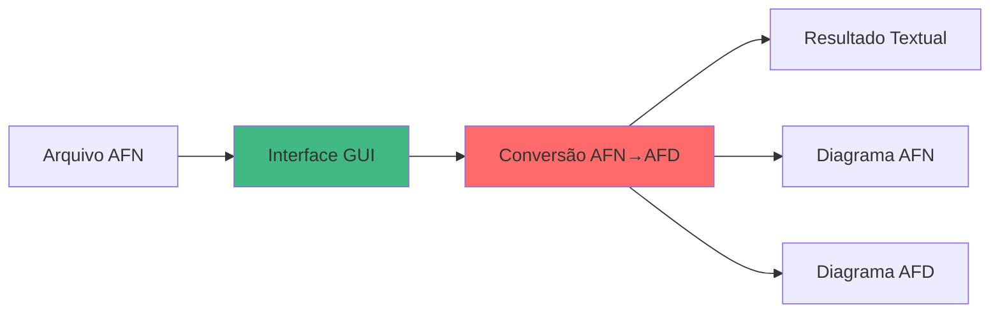

# json2fsm — Conversor AFN → AFD em Pascal

> Conversor de Autômato Finito Não-determinístico (AFN) para Autômato Finito Determinístico (AFD) com visualização gráfica interativa.


## ✨ Principais Recursos

- 🎨 **Interface Gráfica Intuitiva** - GUI desenvolvida com Lazarus LCL
- 📊 **Visualização de Diagramas** - Renderização nativa dos autômatos AFN e AFD
- 🔄 **Conversão Automática** - Algoritmo de construção de subconjuntos
- 📁 **Casos de Teste** - 9 exemplos incluídos para aprendizado
- ⚡ **Performance** - Implementação otimizada em Pascal nativo
- 🖼️ **Layout Dividido** - Compare entrada, resultado textual e diagramas simultaneamente

## 🎯 O que você pode fazer?



1. **Carregar** arquivos `.txt` com especificação de AFN
2. **Editar** manualmente o AFN na interface
3. **Converter** para AFD com um clique
4. **Visualizar** graficamente ambos os autômatos
5. **Comparar** AFN e AFD lado a lado
6. **Testar** com 9 casos de teste incluídos

## 🚀 Início Rápido

<!-- tabs:start -->

#### **Windows**

```powershell
# 1. Clone o repositório
git clone https://github.com/peudias/json2fsm.git
cd json2fsm

# 2. Instale o Lazarus IDE
# Baixe de: https://www.lazarus-ide.org/

# 3. Compile e execute
# No VS Code: Ctrl+Shift+B → "🎨 GUI: Compilar e Executar"
```

#### **Desenvolvimento**

```powershell
# Abrir no VS Code
code .

# Compilar manualmente
C:\lazarus\lazbuild.exe --build-mode=Release src\afn2afdgui.lpi

# Executar
.\bin\afn2afdgui.exe
```

<!-- tabs:end -->

## 📸 Screenshots

### Interface Principal


### Visualização de Diagramas
 

## 🎓 Para quem é este projeto?

- 📚 **Estudantes** de Ciência da Computação aprendendo Teoria da Computação
- 👨‍🏫 **Professores** que querem demonstrar conversão de autômatos visualmente
- 🔬 **Pesquisadores** testando algoritmos de conversão
- 💻 **Desenvolvedores** interessados em Lazarus/Pascal

## 📚 Documentação

Explore a documentação completa:

- [📦 Instalação](instalacao.md) - Guia completo de instalação
- [🎮 Como Usar](uso.md) - Tutorial detalhado da interface
- [🧪 Casos de Teste](testes.md) - Descrição dos 9 testes incluídos
- [🔬 Algoritmo](algoritmo.md) - Explicação do algoritmo de conversão
- [💻 Referência da API](api.md) - Documentação do código Pascal
- [🤝 Contribuindo](contribuindo.md) - Como contribuir com o projeto

## 🌟 Características Técnicas

| Característica | Detalhe |
|----------------|---------|
| **Linguagem** | Free Pascal (Object Pascal) |
| **IDE** | Lazarus 3.6 |
| **Compilador** | FPC 3.2.2 |
| **GUI Framework** | Lazarus LCL (Lazarus Component Library) |
| **Plataforma** | Windows 64-bit |
| **Algoritmo** | Subset Construction (BFS) |

## 🎯 Próximos Passos

<div class="grid">
  <div>
    <a href="#/instalacao" class="button">📦 Instalar Agora</a>
  </div>
  <div>
    <a href="#/uso" class="button">🎮 Ver Tutorial</a>
  </div>
  <div>
    <a href="#/testes" class="button">🧪 Explorar Testes</a>
  </div>
</div>

---

<p align="center">
  <sub>Desenvolvido com ❤️ por <a href="https://github.com/peudias">Henrique</a></sub>
</p>
