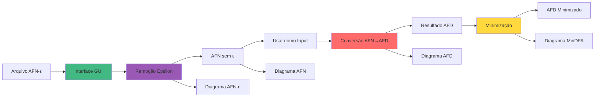

# json2fsm — Conversor AFN-ε → AFN → AFD em Pascal

> Conversor completo de Autômatos Finitos: AFN com Epsilon-Transições → AFN → AFD → AFD Minimizado, com visualização gráfica interativa.


## ✨ Principais Recursos

- 🎨 **Interface Gráfica Intuitiva** - GUI desenvolvida com Lazarus LCL
- 📊 **Visualização de Diagramas** - Renderização nativa de AFN-ε, AFN, AFD e AFD Minimizado
- 🔀 **Remoção de Epsilon** - Conversão de AFN-ε para AFN (sem epsilon-transições)
- 🔄 **Conversão Automática** - Algoritmo de construção de subconjuntos (AFN → AFD)
- ⚡ **Minimização de AFD** - Redução de estados equivalentes (Myhill-Nerode)
- 📋 **Abas Organizadas** - Resultados separados por tipo (AFN, AFD e AFD Minimizado)
- 📥 **Usar como Input** - Copie o AFN resultante para continuar o processo
- 📝 **Logs Detalhados** - Acompanhe cada etapa no terminal
- 📁 **Casos de Teste** - 11 exemplos incluídos (incluindo 2 com epsilon)
- ⚡ **Performance** - Implementação otimizada em Pascal nativo
- 🖼️ **Layout Dividido** - Compare entrada, resultado textual e diagramas simultaneamente

## 🎯 O que você pode fazer?



1. **Carregar** arquivos `.txt` com AFN ou AFN-ε
2. **Remover epsilon** - Converter AFN-ε → AFN
3. **Usar como Input** - Copiar AFN para entrada
4. **Converter** AFN → AFD com um clique
5. **Minimizar** o AFD gerado (reduzir estados)
6. **Visualizar** graficamente AFN-ε, AFN, AFD e AFD Minimizado
7. **Comparar** em abas separadas
8. **Testar** com 11 casos de teste incluídos
9. **Acompanhar logs** detalhados no terminal

## 🚀 Início Rápido

<!-- tabs:start -->

#### **Windows**

```powershell
# 1. Clone o repositório
git clone https://github.com/peudias/json2fsm.git
cd json2fsm

# 2. Instale o Lazarus IDE (arquivo incluído no repo)
.\download_install_lazarus.ps1

# 3. Compile e execute
# No VS Code: Ctrl+Shift+B → "🎨 GUI: Compilar e Executar"
```

#### **Desenvolvimento**

```powershell
# Abrir no VS Code
code .

# Compilar manualmente
C:\lazarus\lazbuild.exe --build-mode=Release src\afn2afdgui.lpi

# Executar
.\bin\afn2afdgui.exe
```

<!-- tabs:end -->

## 📸 Screenshots

### Interface Principal


### Visualização de Diagramas
 

## 🎓 Para quem é este projeto?

- 📚 **Estudantes** de Ciência da Computação aprendendo Teoria da Computação
- 👨‍🏫 **Professores** que querem demonstrar conversão de autômatos visualmente
- 🔬 **Pesquisadores** testando algoritmos de conversão
- 💻 **Desenvolvedores** interessados em Lazarus/Pascal

## 📚 Documentação

Explore a documentação completa:

### 🚀 Começando
- [📦 Instalação](instalacao.md) - Guia completo de instalação do Lazarus 4.4
- [🎮 Como Usar](uso.md) - Tutorial detalhado da interface GUI
- [📂 Estrutura do Projeto](estrutura.md) - Organização de arquivos e pastas
- [⚙️ Tasks do VS Code](tasks.md) - Comandos de compilação e execução

### 🧪 Testes e Teoria
- [🧪 Casos de Teste](testes.md) - Descrição dos 9 testes incluídos
- [🔬 Algoritmo de Conversão](algoritmo.md) - Explicação do algoritmo AFN → AFD
- [⚡ Minimização de AFD](minimizacao.md) - Como funciona a redução de estados

### 💬 Suporte
- [🤝 Contribuindo](contribuindo.md) - Como contribuir com o projeto
- [❓ FAQ](faq.md) - Perguntas frequentes
- [🔧 Troubleshooting](troubleshooting.md) - Solução de problemas

## 🌟 Características Técnicas

| Característica | Detalhe |
|----------------|---------|
| **Linguagem** | Free Pascal (Object Pascal) |
| **IDE** | Lazarus 3.6 |
| **Compilador** | FPC 3.2.2 |
| **GUI Framework** | Lazarus LCL (Lazarus Component Library) |
| **Plataforma** | Windows 64-bit |
| **Algoritmo** | Subset Construction (BFS) |

## 🎯 Próximos Passos

<div class="grid">
  <div>
    <a href="#/instalacao" class="button">📦 Instalar Agora</a>
  </div>
  <div>
    <a href="#/uso" class="button">🎮 Ver Tutorial</a>
  </div>
  <div>
    <a href="#/testes" class="button">🧪 Explorar Testes</a>
  </div>
</div>

---

<p align="center">
  <sub>Desenvolvido com ❤️ por <a href="https://github.com/peudias">Henrique</a></sub>
</p>
