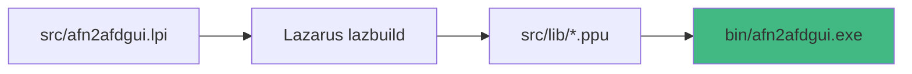

# 📂 Estrutura do Projeto

Este documento descreve a organização dos arquivos e pastas do projeto json2fsm.

## 🗂️ Visão Geral

```
json2fsm/
├── 📁 .vscode/              # Configurações do VS Code
│   └── tasks.json           # Tasks de compilação e execução
├── 📁 bin/                  # Executáveis compilados
│   └── afn2afdgui.exe       # Interface gráfica (gerado após compilação)
├── 📁 docs/                 # Documentação do projeto
│   ├── index.html           # Página principal da documentação
│   ├── README.md            # Home da documentação
│   ├── instalacao.md        # Guia de instalação
│   ├── uso.md               # Tutorial da interface
│   ├── testes.md            # Casos de teste
│   ├── algoritmo.md         # Algoritmo de conversão
│   ├── contribuindo.md      # Guia de contribuição
│   ├── faq.md               # Perguntas frequentes
│   ├── troubleshooting.md   # Solução de problemas
│   └── _sidebar.md          # Menu lateral da documentação
├── 📁 src/                  # Código-fonte
│   ├── afn2afdgui.lpi       # Projeto Lazarus
│   ├── afn2afdgui.lpr       # Programa principal
│   ├── MainForm.pas         # Formulário principal com lógica
│   ├── MainForm.lfm         # Design da interface
│   ├── appicon.ico          # Ícone da aplicação
│   └── lib/                 # Arquivos compilados temporários
├── 📁 testes/               # Arquivos de teste
│   ├── test_ab.txt
│   ├── test_binario.txt
│   ├── test_duplo_inicial.txt
│   ├── test_explosao.txt
│   ├── test_nao_det.txt
│   ├── test_par_a.txt
│   ├── test_simples_nd.txt
│   ├── test_tres_b.txt
│   └── test_tres_simbolos.txt
├── 📄 download_install_lazarus.ps1  # Script de instalação do Lazarus
├── 📄 install_and_compile_gui.ps1   # Script de compilação
├── 📄 lazarus-4.4-fpc-3.2.2-win64.exe  # Instalador do Lazarus
└── 📄 README.md             # Documentação principal

```

## 📝 Arquivos Principais

### Código-Fonte

| Arquivo | Descrição |
|---------|-----------|
| `src/afn2afdgui.lpi` | Arquivo de projeto do Lazarus IDE |
| `src/afn2afdgui.lpr` | Programa principal em Pascal |
| `src/MainForm.pas` | Implementação da interface e lógica de conversão |
| `src/MainForm.lfm` | Definição visual da interface (Lazarus Form) |

### Scripts PowerShell

| Arquivo | Função |
|---------|--------|
| `download_install_lazarus.ps1` | Instala o Lazarus IDE automaticamente |
| `install_and_compile_gui.ps1` | Compila o projeto após instalação |

### Documentação

| Arquivo | Conteúdo |
|---------|----------|
| `README.md` | Visão geral do projeto |
| `docs/README.md` | Home da documentação online |
| `docs/instalacao.md` | Guia de instalação completo |
| `docs/uso.md` | Tutorial da interface GUI |
| `docs/testes.md` | Descrição dos casos de teste |
| `docs/algoritmo.md` | Explicação técnica do algoritmo |

## 🎯 Fluxo de Compilação



### Processo:
1. **Entrada**: `src/afn2afdgui.lpi` (projeto Lazarus)
2. **Compilador**: `C:\lazarus\lazbuild.exe`
3. **Intermediários**: Arquivos `.ppu`, `.o` em `src/lib/`
4. **Saída**: `bin/afn2afdgui.exe` (executável final)

## 🔧 Tasks do VS Code

As tasks estão definidas em `.vscode/tasks.json`:

| Task | Ação |
|------|------|
| 🎨 GUI: Compilar | Compila o projeto com Lazarus |
| 🎨 GUI: Executar | Executa o programa compilado |
| 🎨 GUI: Compilar e Executar | Compila e executa (padrão ao pressionar Ctrl+Shift+B) |
| 🧹 Limpar arquivos compilados | Remove executáveis e arquivos temporários |

## 📦 Arquivos Temporários

Durante a compilação, são gerados arquivos temporários em:
- `src/lib/x86_64-win64/` - Arquivos `.ppu`, `.o`, `.res`
- Estes arquivos podem ser removidos com a task "🧹 Limpar"

## 🧪 Casos de Teste

Todos os arquivos de teste estão em `testes/`:
- Formato: Texto simples (`.txt`)
- Estrutura: Alfabeto, Estados, Iniciais, Finais, Transições
- Total: 9 casos de teste documentados

## 🌐 Documentação Online

A documentação é servida via GitHub Pages:
- **URL**: https://peudias.github.io/json2fsm/
- **Engine**: Docsify
- **Arquivos**: Markdown em `docs/`
- **Configuração**: `docs/index.html`

Para visualizar localmente:
```powershell
# Abra docs/index.html no navegador
start docs/index.html
```

## 💡 Notas Importantes

1. **Não edite manualmente** arquivos em `src/lib/` - são gerados automaticamente
2. **Lazarus obrigatório** em `C:\lazarus` para as tasks funcionarem
3. **MainForm.pas** contém TODA a lógica - não há separação CLI/GUI
4. **Documentação Markdown** usa sintaxe Docsify (`:tabs:`, `:callout:`, etc)
