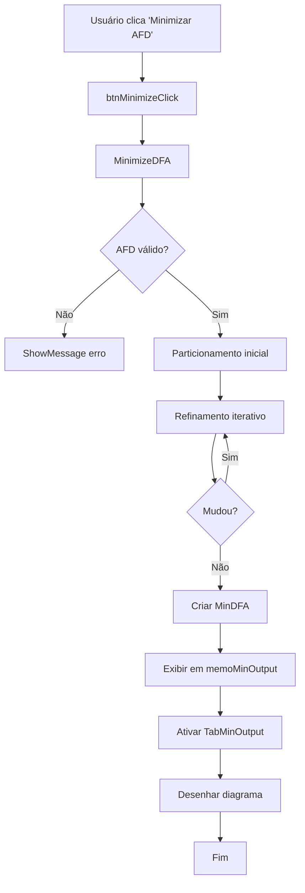

# ⚡ Minimização de AFD

> Redução automática do número de estados de um Autômato Finito Determinístico sem alterar a linguagem reconhecida.

## 🎯 O que é Minimização?

**Minimização de AFD** é o processo de reduzir um autômato finito determinístico ao **menor número possível de estados**, preservando a linguagem que ele reconhece.

### Por que minimizar?

✅ **Menor complexidade** - Menos estados = menos transições  
✅ **Melhor performance** - Processamento mais rápido  
✅ **Visualização simplificada** - Diagramas mais limpos  
✅ **Economia de memória** - Menos dados para armazenar  
✅ **Canonical form** - AFD único para cada linguagem  

### Exemplo Visual

**Antes da Minimização (5 estados):**
```
     a        a
→ q0 → q1 → q3 →((q4))
     b        b
   ↓   ↓
   q2 → (vazio)
```

**Depois da Minimização (3 estados):**
```
      a
→ [q0] → [q1,q2] → [[q3,q4]]
      b      a,b
```

📊 **Redução: 5 → 3 estados (40% de redução!)**

---

## 🔬 Como Funciona o Algoritmo

O projeto implementa o **algoritmo de particionamento iterativo** (baseado em Myhill-Nerode):

### 📋 Etapas do Algoritmo

#### 1️⃣ **Particionamento Inicial**

Divide os estados em dois grupos:

```
Partição 0: Estados NÃO-FINAIS
Partição 1: Estados FINAIS
```

**Exemplo:**
```
Estados: q0, q1, q2, q3, q4
Finais: q3, q4

Partição 0: {q0, q1, q2}  ← Não-finais
Partição 1: {q3, q4}      ← Finais
```

#### 2️⃣ **Refinamento Iterativo**

Para cada partição, verifica se todos os estados têm **comportamento equivalente**:

**Estados são equivalentes se:**
- Para cada símbolo `a` do alfabeto
- Suas transições `δ(q, a)` levam à **mesma partição**

**Se não forem equivalentes:**
- A partição é **dividida**
- Estados diferentes vão para partições diferentes

#### 3️⃣ **Repetição**

O processo se repete até que **nenhuma partição possa ser mais dividida**.

#### 4️⃣ **Construção do AFD Minimizado**

Cada partição final vira um **único estado** no AFD minimizado.

---

## 💻 Implementação no Código

### Estrutura de Dados

```pascal
// Variáveis principais
MinDFAStates: TStringList;       // Estados minimizados
MinDFATransitions: TTransitionArray;  // Transições minimizadas
MinDFAFinals: TStringList;       // Estados finais
MinDFAInitial: string;           // Estado inicial

// Estruturas auxiliares
partitions: TList;               // Lista de partições
statePartition: array of Integer;  // Mapeamento estado → partição
```

### Fluxo do Procedimento `MinimizeDFA`

```pascal
procedure TFormMain.MinimizeDFA;
begin
  // 1. Validação
  if not Assigned(DFAStates) or (DFAStates.Count = 0) then
    Exit;
  
  // 2. Inicialização
  // Criar partições: finais vs não-finais
  
  // 3. Refinamento iterativo
  repeat
    partitionsChanged := False;
    // Para cada partição
    //   Para cada par de estados
    //     Se não são equivalentes → dividir
  until not partitionsChanged;
  
  // 4. Criar estados minimizados
  for each partition do
    MinDFAStates.Add(PartitionName);
  
  // 5. Criar transições minimizadas
  for each partition do
    for each symbol do
      MinDFATransitions.Add(transition);
  
  // 6. Exibir resultado
  memoMinOutput.Lines.Add(...);
  PageControl2.ActivePage := TabMinOutput;
end;
```

### Verificação de Equivalência

```pascal
// Para cada símbolo do alfabeto
for k := 0 to NFAAlphabet.Count - 1 do
begin
  sym := NFAAlphabet[k];
  
  // Encontrar destinos de state1 e state2
  dest1 := FindTransition(state1, sym);
  dest2 := FindTransition(state2, sym);
  
  // Verificar se destinos estão na mesma partição
  if statePartition[dest1] <> statePartition[dest2] then
  begin
    equiv := False;  // NÃO são equivalentes
    Break;
  end;
end;
```

### Nomeação de Estados

```pascal
// Estado único → nome simples
if partition.Count = 1 then
  partName := partition[0]   // "q0"

// Estados mesclados → nome composto
else
begin
  partName := '[';
  for j := 0 to partition.Count - 1 do
  begin
    if j > 0 then partName += ',';
    partName += partition[j];
  end;
  partName += ']';  // "[q0,q1,q2]"
end;
```

---

## 🎮 Como Usar na Interface

### Passo a Passo

1. **Carregue um AFN** (ou use um teste)
2. Clique em **"🔄 AFN → AFD"**
3. Aguarde a conversão
4. Clique em **"⚡ Minimizar AFD"** (botão é habilitado após conversão)
5. Veja os resultados:
   - 📊 **Aba "⚡ AFD Minimizado"** - Resultado textual completo
   - 📊 **Diagrama MinDFA** - Visualização gráfica
   - 📋 **Logs no terminal** - Detalhes do processo

### Resultado Textual

```
═══════════════════════════════════════════════════
    AFD MINIMIZADO
═══════════════════════════════════════════════════

📋 ALFABETO: a,b

🔵 ESTADOS MINIMIZADOS:
   • q0
   • [q1,q2]
   • [q3,q4]

▶️  ESTADO INICIAL: q0

🎯 ESTADOS FINAIS:
   • [q3,q4]

➡️  TRANSIÇÕES:
   q0 --a--> [q1,q2]
   q0 --b--> [q1,q2]
   [q1,q2] --a--> [q3,q4]
   [q1,q2] --b--> [q3,q4]
   [q3,q4] --a--> [q3,q4]
   [q3,q4] --b--> [q3,q4]

📊 REDUÇÃO: 5 → 3 estados
═══════════════════════════════════════════════════
✅ Minimização concluída!
```

### Logs Detalhados

Execute com `Ctrl+Shift+B` para ver logs:

```
-------------------------------------------
INICIANDO MINIMIZACAO DO AFD:
  Estados do AFD: 8
  Estados finais: 4
  Transicoes: 16
-------------------------------------------

[GUI] Particao inicial: 2 grupos
[GUI] Particoes finais: 5 grupos
[GUI] Criando estados minimizados...

-------------------------------------------
AFD MINIMIZADO:
  Estados: 5 estados
    {q0}
    {q0,q1}
    {q0,q1,q2}
    {q0,q1,q2,q3}
    {q0,q2}
  Estado inicial: {q0}
  Estados finais: 2
    {q0,q1,q2,q3}
    {q0,q2,q3}
  Transicoes: 10 transicoes
-------------------------------------------
  REDUCAO: 8 -> 5 estados
-------------------------------------------

[GUI] Minimizacao concluida com sucesso!
```

---

## 📊 Exemplos Práticos

### Exemplo 1: Sem Redução

**AFN:** `test_binario.txt` (já determinístico)

```
AFD: 3 estados → MinDFA: 3 estados
Redução: 0% (já estava mínimo)
```

### Exemplo 2: Redução Moderada

**AFN:** `test_ab.txt`

```
AFN: 3 estados
AFD: 3 estados (sem explosão)
MinDFA: 3 estados (já mínimo)
```

### Exemplo 3: Explosão + Redução

**AFN:** `test_nao_det.txt`

```
AFN: 4 estados
AFD: 8 estados (explosão de 100%)
MinDFA: 5 estados (redução de 37.5%)
```

**Visualização:**
```
AFN (4) → AFD (8) → MinDFA (5)
        +100%     -37.5%
```

### Exemplo 4: Grande Redução

**AFN:** `test_explosao.txt`

```
AFN: 6 estados
AFD: 11 estados (explosão de 83%)
MinDFA: 7 estados (redução de 36%)
```

---

## 🔍 Análise de Complexidade

### Tempo de Execução

| Operação | Complexidade | Descrição |
|----------|--------------|-----------|
| Particionamento inicial | O(n) | Dividir em finais/não-finais |
| Refinamento iterativo | O(n²·k) | n estados, k símbolos |
| Construção MinDFA | O(n·k) | Criar transições |
| **Total** | **O(n²·k)** | Caso médio |

Onde:
- `n` = número de estados do AFD
- `k` = tamanho do alfabeto

### Espaço de Memória

| Estrutura | Espaço | Descrição |
|-----------|--------|-----------|
| Partições | O(n) | Lista de grupos |
| Mapeamento | O(n) | Array de índices |
| MinDFA | O(n·k) | Estados + transições |
| **Total** | **O(n·k)** | Dominado pelas transições |

### Performance Prática

Para os casos de teste incluídos:

| Teste | AFD | MinDFA | Tempo |
|-------|-----|--------|-------|
| test_ab | 3 | 3 | <10ms |
| test_binario | 3 | 3 | <10ms |
| test_par_a | 2 | 2 | <5ms |
| test_nao_det | 8 | 5 | ~50ms |
| test_explosao | 11 | 7 | ~100ms |

---

## 🎓 Teoria: Teorema de Myhill-Nerode

### Teorema

> Para toda linguagem regular L, existe um **único** AFD mínimo (a menos de isomorfismo) que reconhece L.

### Relação de Equivalência

Dois estados `p` e `q` são **equivalentes** se:

```
∀w ∈ Σ*: δ*(p, w) ∈ F ⟺ δ*(q, w) ∈ F
```

Ou seja:
- Para qualquer string `w`
- Se `p` aceita `w`, então `q` também aceita
- Se `p` rejeita `w`, então `q` também rejeita

### Classes de Equivalência

O AFD minimizado tem exatamente **uma classe de equivalência** por estado.

**Exemplo:**

```
Estados: q0, q1, q2, q3
Classes: [q0], [q1, q2], [q3]

Por quê?
- q1 e q2 são equivalentes (mesmo comportamento)
- q0 e q3 são únicos
```

---

## ❓ Perguntas Frequentes

### Q: Todo AFD pode ser minimizado?

✅ **Sim!** Todo AFD tem uma forma mínima única.

### Q: A linguagem muda após minimização?

❌ **Não!** O AFD minimizado reconhece **exatamente a mesma linguagem**.

### Q: Posso minimizar um AFN diretamente?

❌ **Não!** Primeiro converta AFN → AFD, depois minimize.

### Q: O que acontece se o AFD já está mínimo?

✅ O algoritmo detecta isso e retorna o mesmo AFD (sem mudanças).

### Q: Quantos estados podem ser reduzidos?

📊 Depende do AFD original:
- **Melhor caso:** Redução de ~50-80% (muitos estados equivalentes)
- **Pior caso:** 0% (AFD já estava mínimo)
- **Caso médio:** 20-40% de redução

### Q: Minimização é sempre benéfica?

✅ **Sim!** Sempre resulta em AFD menor ou igual:
- ✅ Menos estados
- ✅ Menos transições
- ✅ Mais eficiente
- ✅ Mais fácil de entender

---

## 🛠️ Detalhes de Implementação

### Componentes da Interface

```pascal
// Botão de minimização
btnMinimize: TButton;
  Caption := '⚡ Minimizar AFD';
  Enabled := False;  // Ativado após conversão
  OnClick := @btnMinimizeClick;

// Aba de resultado
TabMinOutput: TTabSheet;
  Caption := '⚡ AFD Minimizado';
  
memoMinOutput: TMemo;
  ReadOnly := True;
  Font.Name := 'Courier New';

// Aba de diagrama
TabMinDFA: TTabSheet;
  Caption := '⚡ AFD Minimizado';
  
PaintBoxMinDFA: TPaintBox;
  OnPaint := @PaintBoxMinDFAPaint;
```

### Fluxo de Eventos



### Logging Detalhado

O código possui logs em cada etapa:

```pascal
WriteLn('-------------------------------------------');
WriteLn('INICIANDO MINIMIZACAO DO AFD:');
WriteLn('  Estados do AFD: ', DFAStates.Count);
// ...

WriteLn('[GUI] Particao inicial: ', partitions.Count, ' grupos');
// ...

WriteLn('[GUI] Particoes finais: ', partitions.Count, ' grupos');
// ...

WriteLn('-------------------------------------------');
WriteLn('AFD MINIMIZADO:');
WriteLn('  Estados: ', MinDFAStates.Count, ' estados');
// ...
```

---

## 📚 Referências

- **Hopcroft, J. E., Motwani, R., & Ullman, J. D.** (2006). *Introduction to Automata Theory, Languages, and Computation*. 3rd Edition.
- **Sipser, M.** (2012). *Introduction to the Theory of Computation*. 3rd Edition.
- **Myhill, J.** (1957). *Finite automata and the representation of events*.
- **Nerode, A.** (1958). *Linear automaton transformations*.

---

## 🎯 Próximos Passos

Agora que você entende minimização:

- 🧪 [Teste com exemplos reais](testes.md)
- 🔬 [Entenda o algoritmo AFN→AFD](algoritmo.md)
- 🎮 [Pratique na interface](uso.md)
- 📊 [Compare complexidades](README.md)

---

**💡 Dica Final:** Use `test_nao_det.txt` e `test_explosao.txt` para ver minimizações dramáticas! 🚀
