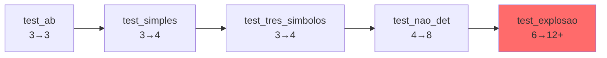

# 🧪 Casos de Teste

O projeto inclui **9 casos de teste** cuidadosamente elaborados no diretório `testes/`. Cada um demonstra aspectos diferentes da conversão AFN → AFD.

## 📋 Visão Geral dos Testes

| Arquivo | Complexidade | AFN States | DFA States | Descrição |
|---------|--------------|------------|------------|-----------|
| `test_ab.txt` | ⭐ Simples | 3 | 3 | Strings terminando em "ab" |
| `test_binario.txt` | ⭐ Simples | 3 | 3 | Já determinístico |
| `test_simples_nd.txt` | ⭐ Simples | 3 | 4 | Não-determinismo básico |
| `test_par_a.txt` | ⭐⭐ Médio | 2 | 2 | Número par de 'a's |
| `test_tres_b.txt` | ⭐⭐ Médio | 5 | 5 | ≥3 'b's consecutivos |
| `test_duplo_inicial.txt` | ⭐⭐ Médio | 3 | 3 | Múltiplos estados iniciais |
| `test_tres_simbolos.txt` | ⭐⭐⭐ Avançado | 3 | 4 | Alfabeto com 3 símbolos |
| `test_nao_det.txt` | ⭐⭐⭐ Avançado | 4 | 8 | Explosão de estados! 💥 |
| `test_explosao.txt` | ⭐⭐⭐⭐ Expert | 6 | 12+ | Estados compostos complexos |

## 🌟 Testes Básicos

### 1️⃣ test_ab.txt - Strings terminando em "ab"

**Arquivo:**
```
a b
q0 q1 q2
q0
q2
q0 a q0
q0 b q0
q0 a q1
q1 b q2
```

**O que faz:**
- ✅ Aceita: `"ab"`, `"aab"`, `"bab"`, `"aaab"`
- ❌ Rejeita: `"a"`, `"ba"`, `"aba"`, `"bb"`

**Conceito demonstrado:** Não-determinismo simples
- Estado `q0` com `'a'` pode ir para `q0` OU `q1`

**AFN → AFD:**
- 3 estados → 3 estados
- Exemplo clássico de conversão sem explosão

---

### 2️⃣ test_binario.txt - Sequências binárias múltiplas de 3

**Arquivo:**
```
0 1
s0 s1 s2
s0
s0
s0 0 s1
s0 1 s1
s1 0 s2
s1 1 s2
s2 0 s0
s2 1 s0
```

**O que faz:**
- ✅ Aceita: `"000"`, `"111"`, `"010101"` (comprimento múltiplo de 3)
- ❌ Rejeita: `"0"`, `"01"`, `"0101"`

**Conceito demonstrado:** AFD já determinístico
- Cada estado tem exatamente uma transição por símbolo
- Conversão não altera número de estados

**AFN → AFD:**
- 3 estados → 3 estados (sem mudança)
- Demonstra que nem todo AFN precisa explodir

---

### 3️⃣ test_simples_nd.txt - Não-determinismo básico

**Arquivo:**
```
a b
q0 q1 q2
q0
q2
q0 a q0
q0 a q1
q0 b q0
q1 a q2
q1 b q2
```

**O que faz:**
- ✅ Aceita: `"aa"`, `"aaa"`, `"aba"`
- ❌ Rejeita: `"a"`, `"b"`, `"ba"`

**Conceito demonstrado:** Múltiplas transições
- `q0` com `'a'` → `q0` ou `q1` (escolha não-determinística)

**AFN → AFD:**
- 3 estados → 4 estados
- Gera estados compostos: `{q0}`, `{q0,q1}`, `{q0,q2}`, `∅`

---

## 🎯 Testes de Características Especiais

### 4️⃣ test_par_a.txt - Número par de 'a's

**Arquivo:**
```
a b
q0 q1
q0
q0
q0 a q1
q0 b q0
q1 a q0
q1 b q1
```

**O que faz:**
- ✅ Aceita: `""`, `"aa"`, `"aaaa"`, `"baab"`
- ❌ Rejeita: `"a"`, `"aaa"`, `"ba"`

**Conceito demonstrado:** Contador de paridade
- Autômato "conta" quantos 'a's foram lidos (par/ímpar)

**AFN → AFD:**
- 2 estados → 2 estados
- Exemplo de autômato compacto e elegante

---

### 5️⃣ test_tres_b.txt - Pelo menos 3 'b's consecutivos

**Arquivo:**
```
a b
q0 q1 q2 q3 q4
q0
q4
q0 a q0
q0 b q1
q1 a q0
q1 b q2
q2 a q0
q2 b q3
q3 a q4
q3 b q3
q4 a q4
q4 b q4
```

**O que faz:**
- ✅ Aceita: `"bbb"`, `"abbb"`, `"bbba"`, `"abbba"`
- ❌ Rejeita: `"bb"`, `"aba"`, `"bbab"`

**Conceito demonstrado:** Contador de símbolos consecutivos
- Precisa ver pelo menos 3 'b's seguidos

**AFN → AFD:**
- 5 estados → 5 estados
- Estado "trap" `q4` (aceita tudo depois de ver 3 'b's)

---

### 6️⃣ test_duplo_inicial.txt - Múltiplos estados iniciais

**Arquivo:**
```
a b
q0 q1 q2
q0 q1
q2
q0 a q2
q1 b q2
q2 a q2
q2 b q2
```

**O que faz:**
- ✅ Aceita: `"a"`, `"b"`, `"aa"`, `"bb"`
- ❌ Rejeita: (nenhum, aceita tudo após primeiro símbolo)

**Conceito demonstrado:** Múltiplos estados iniciais
- AFN pode começar em `q0` **E** `q1` simultaneamente
- AFD combina em um único estado inicial: `{q0,q1}`

**AFN → AFD:**
- 3 estados → 3 estados
- Estado inicial do DFA: `{q0,q1}`

---

### 7️⃣ test_tres_simbolos.txt - Alfabeto com 3 símbolos

**Arquivo:**
```
a b c
q0 q1 q2
q0
q2
q0 a q1
q0 b q0
q0 c q0
q1 b q2
q1 a q1
q1 c q1
q2 a q2
q2 b q2
q2 c q2
```

**O que faz:**
- ✅ Aceita: `"ab"`, `"aab"`, `"acab"`
- ❌ Rejeita: `"a"`, `"ba"`, `"c"`

**Conceito demonstrado:** Alfabeto maior
- Cada estado tem **3 transições** (uma por símbolo)
- Mais complexidade no diagrama

**AFN → AFD:**
- 3 estados → 4 estados
- Demonstra escalabilidade do algoritmo

---

## 💥 Testes de Explosão de Estados

### 8️⃣ test_nao_det.txt - Contém "aaa" 🔥

**Arquivo:**
```
a b
q0 q1 q2 q3
q0
q3
q0 a q0
q0 a q1
q1 a q2
q2 a q3
q0 b q0
q1 b q1
q2 b q2
q3 b q3
```

**O que faz:**
- ✅ Aceita: `"aaa"`, `"aaaa"`, `"baaa"`, `"aaab"`
- ❌ Rejeita: `"aa"`, `"a"`, `"bbb"`

**Conceito demonstrado:** EXPLOSÃO COMBINATÓRIA! 💥
- 4 estados do AFN → **8 estados** do AFD
- Estados compostos: `{q0}`, `{q0,q1}`, `{q0,q1,q2}`, `{q0,q1,q2,q3}`, etc.

**AFN → AFD:**
```
AFN: 4 estados
DFA: 8 estados compostos!
  • {q0}
  • {q0,q1}
  • {q0,q1,q2}
  • {q0,q1,q2,q3}
  • {q0,q2}
  • {q0,q2,q3}
  • {q0,q3}
  • {q0,q1,q3}
```

**Por que explode?**
- Cada 'a' pode manter ou avançar múltiplos estados simultaneamente
- Crescimento **exponencial** no pior caso

---

### 9️⃣ test_explosao.txt - Estados compostos complexos 💣

**Arquivo:**
```
a b
q0 q1 q2 q3 q4 q5
q0
q5
q0 a q0
q0 a q1
q0 b q0
q1 a q2
q1 b q3
q2 a q4
q2 b q5
q3 a q5
q4 a q5
```

**O que faz:**
- Aceita padrões complexos
- Múltiplos caminhos para estados finais

**Conceito demonstrado:** Teste de limites
- 6 estados do AFN → **12+ estados** do AFD
- Testa performance do algoritmo
- Diagrama fica muito grande!

**AFN → AFD:**
- Gera muitos estados compostos
- Exemplo de pior caso do algoritmo

---

## 🎮 Como Usar os Testes

### Método 1: Via GUI

1. Abra a aplicação
2. Clique em **"📂 Carregar Arquivo..."**
3. Navegue até `testes/`
4. Selecione o arquivo de teste
5. Clique em **"🔄 Converter"**
6. Compare os diagramas!

### Método 2: Criar Seus Próprios Testes

Crie um arquivo `.txt` seguindo o formato:

```
<símbolos separados por espaço>
<estados separados por espaço>
<estados iniciais separados por espaço>
<estados finais separados por espaço>
<origem> <símbolo> <destino>
<origem> <símbolo> <destino>
...
```

## 📊 Comparação de Complexidade

### Crescimento de Estados



### Tempo de Conversão (estimado)

| Teste | Tempo | Memória |
|-------|-------|---------|
| Básicos (1-3) | <100ms | <1MB |
| Médios (4-7) | 100-300ms | 1-2MB |
| Avançados (8-9) | 500ms-1s | 2-5MB |

## 💡 Dicas de Aprendizado

### Para Iniciantes
1. Comece com `test_ab.txt`
2. Depois `test_simples_nd.txt`
3. Por último `test_par_a.txt`

### Para Intermediários
1. Teste `test_tres_b.txt` (contador)
2. Explore `test_duplo_inicial.txt` (múltiplos iniciais)
3. Desafie-se com `test_tres_simbolos.txt` (alfabeto maior)

### Para Avançados
1. Analise `test_nao_det.txt` (explosão controlada)
2. Quebre a cabeça com `test_explosao.txt` (caos total!)
3. Crie seus próprios testes desafiadores

## 🎯 Exercícios Propostos

1. **Modifique test_ab.txt** para aceitar strings terminando em "ba"
2. **Crie um AFN** que aceita números binários divisíveis por 4
3. **Teste explosão extrema:** AFN com 10 estados não-determinísticos
4. **Minimize manualmente** o AFD gerado por `test_nao_det.txt`

## 📚 Próximos Passos

Agora que você conhece todos os testes:

- 🔬 [Entenda o Algoritmo de Conversão](algoritmo.md)
- 📐 [Veja a Análise de Complexidade](complexidade.md)
- 💻 [Explore o Código Fonte](api.md)

---

**💡 Dica:** Use `test_nao_det.txt` para impressionar em apresentações - a explosão visual de estados é incrível! 🤯
